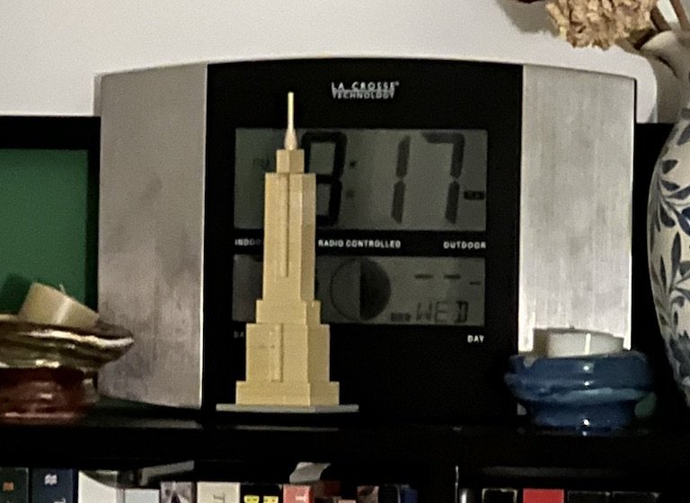
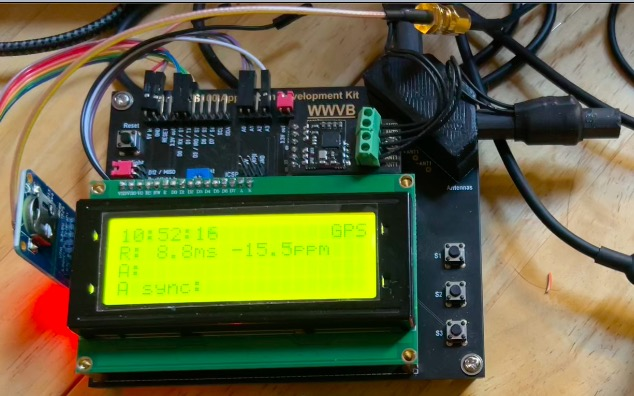
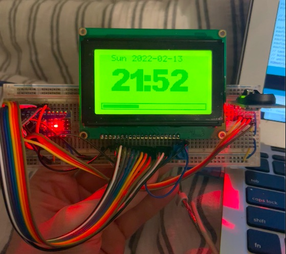
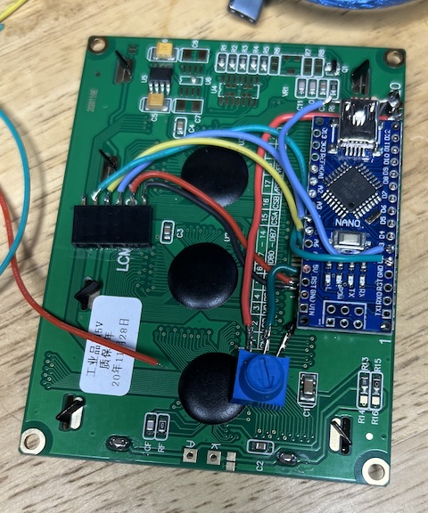
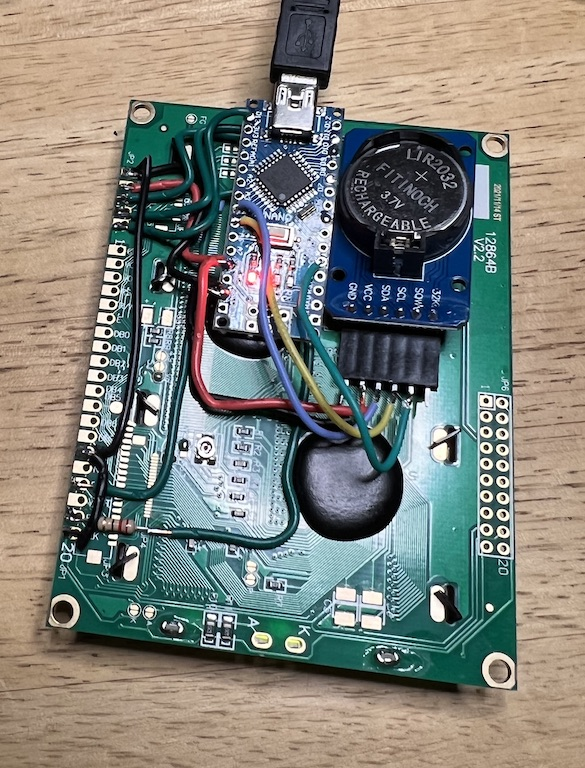
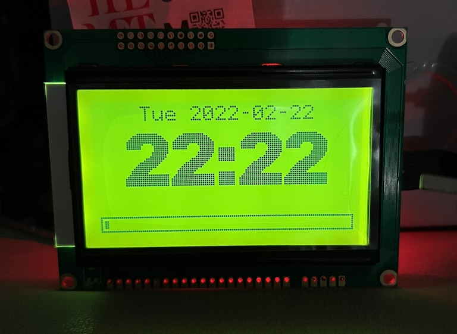

### ClockBlog

## 2022-04-09 
# KS0108 LCD Matrix Clock

In my quest for synchronization sources, I got interested in the "Atomic Time" broadcast by NIST from Ft Collins Colorado - [WWVB](https://en.wikipedia.org/wiki/WWVB) - that is the basis of consumer self-settig clocks including one I own from La Crosse.  They're temperamental in New York, because the reception from Colorado is weak; however, if I keep mine in a south-facing window, it manages to sync.

It turns out that in addition to the low-bitrate AM 60 kHz time signal used by the clocks, NIST added a more robust PSK encoding on top - encoding the data stream in phase shifts of the 60 kHz carrier.  However, there are not many receivers available.  The most promising one was a [development board](https://universal-solder.ca/product/canaduino-application-development-kit-with-everset-es100-mod-wwvb-bpsk-atomic-clock-receiver-module/) for the ES100 module, sold by Canaduino.  I bought one and built it.  Although it was fascinating in its way, even the PSK signal was hard to receive in New York, and very frustrating to experiment with since it took more that two minutes before it even told you that the signal was too weak and the antenna needed repositioning.  

The very smart development board was basically just an Arduino with a DS1307 for time backup and a 20x4 LCD character display.  It turned out that LCD was my favorite part - I liked the large pixels, the black-on-green aesthetic, the utilitarian vibe.  I think it is drawing on some tech lust from my childhood, when cutting-edge tech (think Yamaha rack-mount MIDI-controlled FM synthesizer engine) would include a display like this.  But the fact that the pixels were arranged in 7x5 character cells with 1 pixel gaps in-between really limited this particular display's flexibility.

After a bit of searching, I found that there were full-density 128x64 LCD matrices available, so I just bought the cheapest thing that looked right.  What I didn't know was that there are (at least) two different flavors: Panels based on an 8-bit parallel interface which need a total of 13 pins or so to control, and panels with a serial interface needing only 3 or 4 pins.  The first panel I got was of the parallel flavor (based on the [KS0108](http://exploreembedded.com/wiki/Graphics_LCD_Basics_:_KS0108_based_JHD12864E) chipset); After spending a lot of time not understanding how to use the Vout and Vo biasing, I managed to get this working using the [OpenGLCD](https://bitbucket.org/bperrybap/openglcd/wiki/Home) library.  This is a great library - fast and complete - but the physical setup is just a lot of wires to connect, and leaves almost no pins left for other peripherals when using a standard Arduino.  I made a clock display sketch, to display the time read from a DS3231 RTC connected on I2C: [glcd_clock](https://github.com/dpwe/arduinoclocks/blob/main/glcd_clock/glcd_clock.ino).  This made use of a very attractive large font for the numbers, [CalBlk36](https://github.com/johnmccombs/calfonts) by John McCombs in New Zealand.

So then I went looking for LCD panels that included an I2C serial-to-parallel converter, figuring this must be something that someone had made to ease interfacing to Arduino.  I found a promising-looking bundle on eBay. When it arrived, however, I realized the I2C interface was for a *character* LCD panel (e.g., 16x2 characters using HD44780), not the dot-matrix panel it came with.  However, I also realized that the panel was different from my first panel, and included promisingly-labeled pins for CS, SCK, and MOSI - indicating a serial SPI interface.  A bit more investigation revealed the new panel was based on the [ST7920](https://www.instructables.com/ST7920-LCD-With-ATmega328-in-Atmel-Studio-Using-SP/) chipset, and could be driven by both parallel *and* serial interfaces.  I soon found the [u8g2](https://github.com/olikraus/u8g2) library able to drive a wide array of serial-based matrix displays, and had it running.  

U8g2 offers the same kind of high-performance, fully-featured functionality as OpenGLCD, but only for serial-controlled panels.  (It also has some fairly complicated configuration options, depending on how much local RAM you want to use, since the displays are using a write-only interface.)  I rewrote the clock to use this library, which ended up being a complete rewrite: [u8g2_clock](https://github.com/dpwe/arduinoclocks/blob/main/u8g2_clock/u8g2_clock.ino).  However, there wasn't a nice-looking big font like the one in glcd.  To my surprise, transferring fonts from glcd to u8g2 was apparently unsolved: glcd used fonts saved by an obscure bitmap editor in Java, [fontcreator2](https://www.extremeelectronics.co.in/downloads/ProGFX/GLCDFontCreator2.zip) by Maximilian Thiele.  u8g2 will import bitmap fonts saved in the old X11 BDF format, but there wasn't a tool to translate between the two.  So I [wrote one](https://github.com/dpwe/calfonts/blob/add-bd/glcd-fontcreator-to-bdf.ipynb) in IPython Notebook, and successfully ported the CalBlk36 font into u8g2 (olikraus [incorporated this into the main distro](https://github.com/olikraus/u8g2/issues/1263)).

Meanwhile, the ks0108 panel was still tying up one of my breadboards.  

I realized that if it would work using 8 sequential Arduino pins for its 8 data pins, I could mount an Arduino Nano directly on the back of the display and reduce the total amount of wiring by having those 8 pins sit right on the connector.  There are some constraints on which pins you can use and still take advantage of the optimized AVR code in openGLCD, but this worked.  I was also able to move around some of the other stock pins to further simplify wiring, and to free up a PWM pin to use for backlight control (as well as the I2C pins and an interrupt pin to connect to the DS3231).  The build turned out to be pretty quick:

It didn't work at all the first time I booted it up. Turns out I had connected the Chip Select line to the Reset pin (its neighbor, which I had intended to leave unconnected).  This was a scary moment, because having hard-connected the Nano to the back of the panel with 8 data lines going straight onto pins, it was practically impossible to get under the Nano to fix any wiring problems there.  Fortunately, I was able to get in from the side.  In the end, the clock turned out nice, mounted in a cheap little trinket box;

For completeness/contrast I also built a clock with the ST7920 panel, also with an Arduino Nano, but floating on wires rather than hard-connected to pins.  The DS3231 board sits in a 6 pin header which is superglued to the back of the panel. (This means I can take out the modules to synchronize them).  Then the Nano is held more or less in place via the wires to that header and to the panel pads.

The clock display is almost identical to the KS0108 version, once I employ the newly-ported font:

