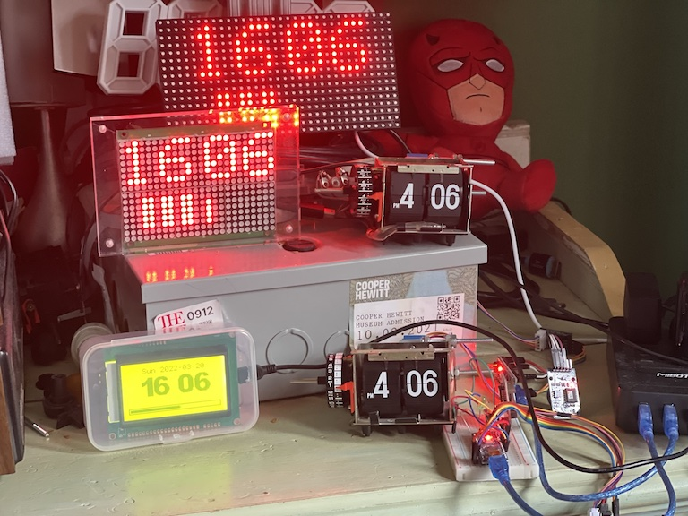
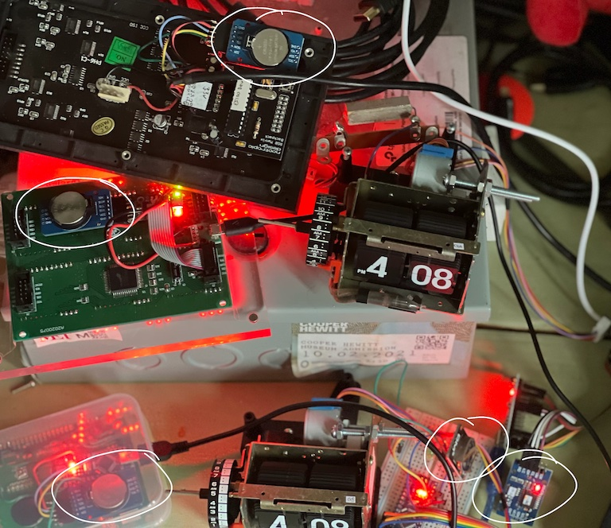
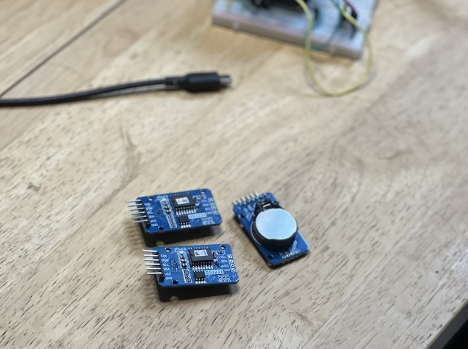
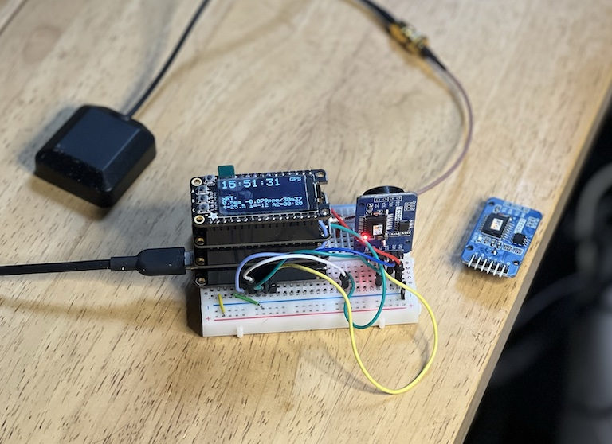
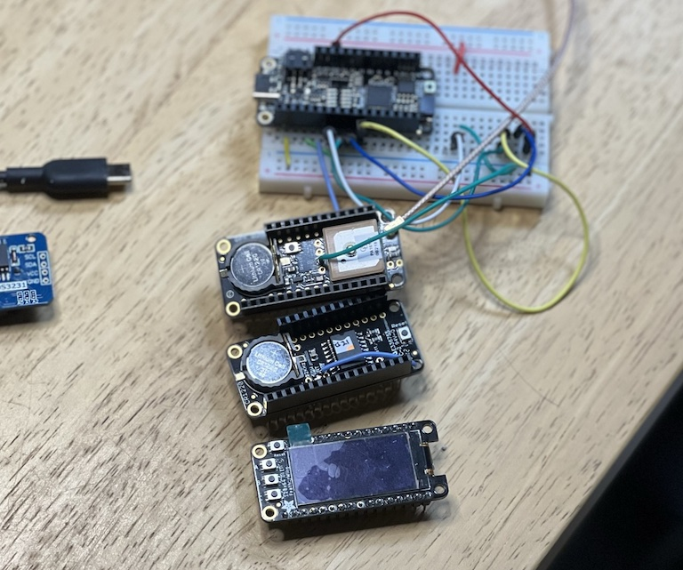
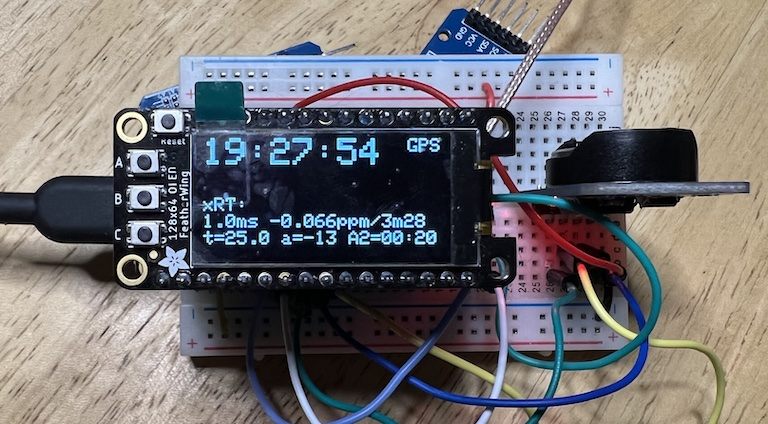

### [dpwe](https://github.com/dpwe) [ClockBlog](https://dpwe.github.io/arduinoclocks/)

## 2022-03-20 
# GPS-RTC Synchronizer

I've made a bunch of digital clocks in different formats:

The essence of a clock is keeping track of time.  All these clocks are stand-alone (i.e., not online), and they all get their truth for time from the same source: A [DS3231SN](https://datasheets.maximintegrated.com/en/ds/DS3231.pdf) "extremely-accurate RTC/TXCO" - a real-time clock (RTC) chip with integrated crystal and, crucially, temperature compensation.  I bought modules based on these chips in packs of five available for under $20 online.

Maxim promises +/- 2 ppm (parts per million) for these chips; there are about 31 million seconds in a year, so 2ppm is accuracy to about 1 minute/year.

Incidentally, it's slightly incredible that I can get these modules for under $4 each. Prices for the chip alone are about $10, falling to only $8 in quantities of 500+.  This leads to speculation that the boards are using counterfeit chips, but on [this page](https://blog.heypete.com/2017/07/29/a-look-inside-the-ds3231-real-time-clock/), heypete actually cut away the casing to expose the chip die from a cheap module, and everything looks right. I was careful to choose a supplier that promised DS3231SN chips (instead of the slightly less accurate DS3231M chips, which uses a MEMS resonator instead of a crystal; more details are provided again by [heypete](https://blog.heypete.com/2017/09/05/major-differences-between-the-ds3231-and-ds3231m-rtc-chips/)).

When I first started making clocks based on these modules, I deployed them as received, and simply provided a mechanism to set the clock by hand (e.g., over the USB/serial interface to the Arduino core).  However, when you have mutiple clocks side-by-side -- particularly the mechanical flip-clock mechanism that makes a clear "click" every minute -- you become aware of the drift between the different clocks.  Within a couple of weeks, my two flip clocks were several seconds apart, something I was reminded of every minute.

The DS3231SN, however, provides a mechanism to tune the accuracy to better than the out-of-box 2ppm.  The "aging offset register" can take a signed 8 bit value (-128 to 127) that shifts the existing temperature-compensation mechanism by a fixed offset.  The datasheet suggests one step corresponds to about 0.1 ppm change (larger values give slower oscillation), although in my experience it's closer to 0.05 ppm.  Thus, it's usually possible to set this register to achieve an overall accuracy within +/- 0.03 ppm, or one second a year.  (This of course depends on the long-term stability of the oscillations; it's called an aging offset register for a reason, after all.)

So, given the mechanism to trim the clock frequency, we now need a gold-standard reference to match them to.  This could be a tricky problem.  I could set them against the crystal of a computer, but even a high-quality crystal will only be spec'd to around 10ppm, so we need something much better.  

There's "network time" from the internet -- the thing that sets the time on your smartphone -- but because of uncontrolled variability in how long it takes messages to traverse the network, it's only accurate to maybe 50-100ms. To get down to below 0.1 ppm with that level of noise, I'd need to be measuring over a period of a million seconds, or almost two weeks.  (The underlying clock is good to a "global consensus" of maybe 0.000001 ppm -- see this excellent presentation of [Clock Powers of Ten](http://www.leapsecond.com/ten/clock-powers-of-ten-tvb.pdf)).  

Fortunately, and miraculously, there's a cheap and globally-available solution -- GPS.  GPS modules provide a "1PPS" (one pulse per second) output, a 1 Hz square wave that claims something like 10 ns accuracy, or 0.01 ppm over one second, all synchronized to a global consensus via a network of extremely accurate atomic clocks.  And those signals are literally beamed to my window sill via a fleet of satellites, and decoded for my hobbying pleasure via a [$30 module](https://www.adafruit.com/product/746) (which is made significantly easier to use by adding a [$20 external antenna](https://www.adafruit.com/product/960)).  Although these are much more expensive than the RTC chips, the key point is I can use a single GPS setup to tune the aging offset register in each of my DS3231s, after which they should be good to keep time without further attention for a year or more.

Which leads us to the topic of this post, the Synchronizer:

This assemblage consist of:

* An MCU, here a [Feather RP2040](https://www.adafruit.com/product/4884) (though mine is black not pink).  I tried using a Feather M4, but because that device generates its system clock from a 32 kHz crystal, it was very unstable at the microsecond level.  The 10 MHz crystal on the RP2040 board gives much more consistent behavior.
* A [GPS featherwing](https://www.adafruit.com/product/3133) (i.e., a GPS receiver in the same Feather board format)
* A [128x64 Monochrome OLED](https://www.adafruit.com/product/4650), also in Feather format.  This includes 3 buttons, perfect for a minimal UI.
* And a [Feather-format DS3231](https://www.adafruit.com/product/3028), which I'll explain later.

In the assembly, they are all connected via [stacking header pins](https://www.adafruit.com/product/2830), but here they are separated apart:

Notice how I've had to solder extra wires onto the GPS and DS3231 boards.  These pull out the 1PPS square waves from each board, which I then feed to separate input pins on the MCU.

So what does the synchronizer do?  Essentially, it takes the 1PPS outputs from the GPS and RTC and "timestamps" them against the internal clock -- the Arduino `micros()` function.  We can read the GPS and RTC to find out the actual times corresponding to each observed PPS transition, and thus calculate their relative agreement (clock skew) down to microsecond accuracy.  

Now, as we've discussed, the MCU clock, and hence the `micros()` function, can only be relied upon to 10ppm or so, and will not be temperature compensated.  But it will be consistent over a timescale of seconds, so we can take the difference in `micros()` between success GPS PPS edges, and use that to calibrate the internal clock.  We can also measure the `micros()` period of the DS3231 to get a 1ppm-resolution indication of the clock frequency every second (i.e. one microsecond per second).  By extending the measurement period to 10s or 100s, I can get the resolution down to 0.1 or 0.01 ppm. Then, by calibrating with the GPS timings, I can get a very precise measurement of the RTC frequency when compared to the GPS reference, allowing me to adjust the aging offset register to get it down to within 0.03 ppm.

The idea is that I can pull a DS3231 module from one of my clocks, plug it into the breadboard, re-set its time to be exactly sync'd to the GPS (the delay in sending the I2C commands means this works out to be possible to within about 1ms), *and* trim the aging offset register to get frequency agreement to 0.03 ppm. 

The way it works is this: You plug in the DS3231 module, power up the assembly, and after a few minutes (once the GPS lock is established), it looks something like this:

We see the current time from the GPS module (converted to local time), the relative sync of the external RTC (here, 1.0ms later), and the frequency accuracy (here 0.066 ppm slow, averaged over a 3 min 28 sec interval). We also see that the RTC is reporting an internal temperature of 25 C, the aging register is set to -13, and Alarm2 (which I use as display state memory in the flip clocks) is set to 00:20.

The three buttons allow things like triggering a manual sync of the RTC time to the current GPS time, and increasing and decreasing the aging offset.  Note, that the aging offset only takes effect at the next temperature measurement/compensation adjustment, which is supposedly every 64 seconds.  In my experience, it takes a few minutes for changes in the aging offset to be visible in the measured ppm, not least because, given our microsecond quanta, it takes at least 100 sec for us to get a ppm measurement to 0.01 ppm resolution.

Now what about that second DS3231 in the Feather stack, which I call the internal RTC?  My idea is to use that to be able to "cache" the GPS sync for a short while even if GPS reception is not available.  You run the stack with GPS active, fully calibrate the internal RTC, then can take the package elsewhere to set external RTCs, relying on the internal RTC not to deviate too far too fast.  I have [the code](https://github.com/dpwe/arduinoclocks/blob/main/synchronizer_feather/synchronizer_feather.ino) able to read and switch between both RTCs at present (using two I2C interfaces), and I have the system clock falling back on the internal RTC when the GPS lock is lost, but I haven't yet implemented synchronizing the external RTC to the internal RTC (instead of the GPS).
