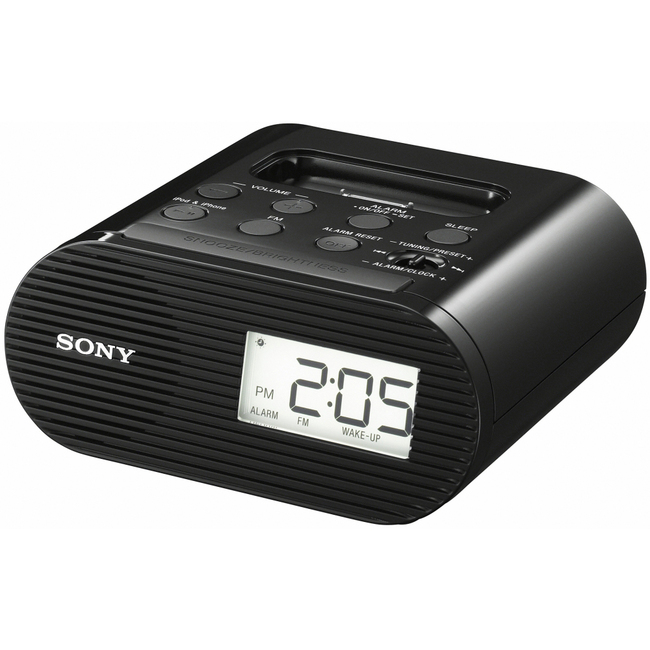
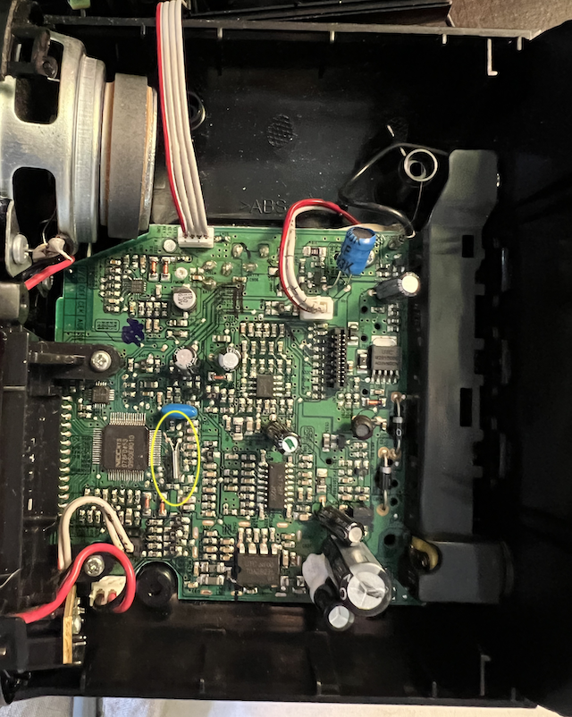
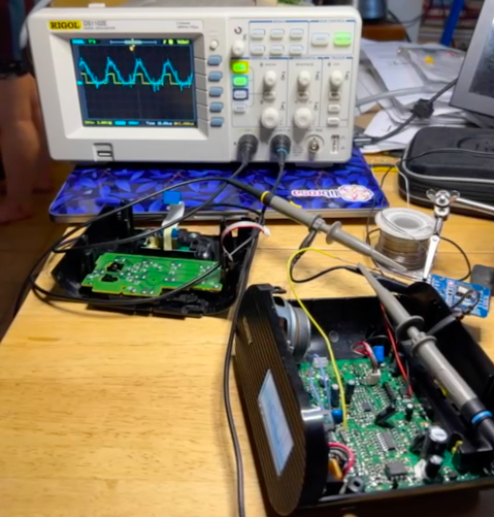
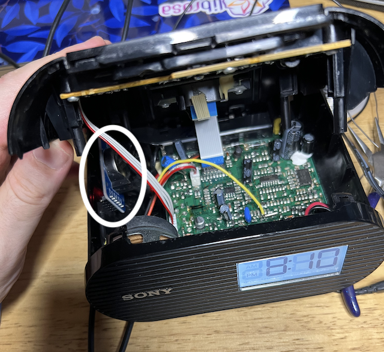

### [ClockBlog](index.md)

## 2022-07-21 
# Adding a Temperature-Compensated Crystal Oscillator to a Consumer Clock Radio

I love clocks and I love listening to the radio so naturally my bedside clock radio is close to my heart.  On my nighstand I currently have a Sony ICF-C05iP:

I'm not sure when I got this, but the 30-pin iPod/iPhone dock certainly dates it. To their credit, Sony still hosts the [User manual](https://www.sony.com/electronics/support/res/manuals/4174/41747321M.pdf), which is dated 2010, so we'll go with that date.

I don't use the iPod dock any more, but I do faithfully use the radio, and I particularly like that the dimmest setting on the clock backlight is very dim, so it doesn't excessively illuminate my sleeping space.  The radio sound is good and the tuning is digital.

The one thing I *don't* like is that the clock isn't very accurate.  It seems like it's always a couple of minutes slow, so that when I try to turn it on at the top of the hour to get the news, I've missed the first minute.  These clocks rely on 32.768 kHz quartz crystals to keep time, and such crystals are usually spec'd to 10-20 ppm accuracy.  At 86,400 seconds per day, 10ppm is drifting by a about minute every two months.  I think the industry has decided this is acceptable.

Following my recent obsession with [DS3231-based clocks](2022-03-20-synchronizer.md), 10ppm isn't really tolerable to me any more.  In fact, I've long wondered about trimming the clock in my device, particularly since I learned about [the effect of capacitance loading on crystal oscillators](https://www.allaboutcircuits.com/technical-articles/assessing-effect-of-load-capacitance-on-frequency-of-quartz-crystal/).  One problem, however, is that I did't obviously have a quick way to accurately measure the new clock performance after adding capacitance - the only way I read this clock is watching the digits change, and I'd need to wait at least a week for a 1 ppm change to be measured by eye with any accuracy.

But then I had another idea: A crystal oscillator circuit is a pretty delicate feedback oscillator, which is why it's sensitive to capacitor loading.  Perhaps I could simply inject a higher-quality 32.768 kHz signal into the circuit and have the clock sync to that?  The DS3231SN modules I've been using can be tuned down to better than 1ppm accuracy, and I have several to hand.  Worth a try!

Opening up the clock, I found lots of space and an easily-accessible circuit board:

The 32 kHz crystal in its cylindrical canister (outlined in yellow) is easily recognizable.  To my surprise, several of these chips are also commercially-available; in particular, the large 64-pin LQFP chip is a [D78F0453](https://www.farnell.com/datasheets/1653565.pdf), am 8051-type 8 bit microcontroller including on-board RAM (flash or mask-programmed), and LCD driving circuitry.

Fortunately, I have a nice oscilloscope that allowed me to inspect the crystal oscillator circuit in-situ.  By comparing the oscillation of the clock's crystal to the stabilized 32 kHz output from the DS3231 board, I could see that crystal was running at a slightly lower frequency.  (I had to use the oscilloscope probe in "x10" mode to minimize the additional load it presented to the delicate crystal circuit, so it would continue oscillating):

I played around with "nudging" the crystal oscillation by feeding the DS3231 32 kHz square wave into the crystal circuit via a large-ish resistor.  On one side of the crystal, adding any input stopped the oscillator altogether.  But on the other side, connecting the DS3231 output via a 100k resistor was enough to "lock" the crystal waveform to the frequency from the DS3231.  This gave me what I wanted - the clock's 32 kHz signal synced to the trimmed, temperature-compensated 32 kHz signal coming out of the DS3231 board.

I powered the DS3231 board by wiring it to the 5V output on the regulator, wired up the resistor to connect to the crystal (the long yellow wire) and tucked it in to the side of the clock (outlined in white):

So far, the clock has been keeping good time, although it will take a few weeks before I can be sure it's no longer losing time.
