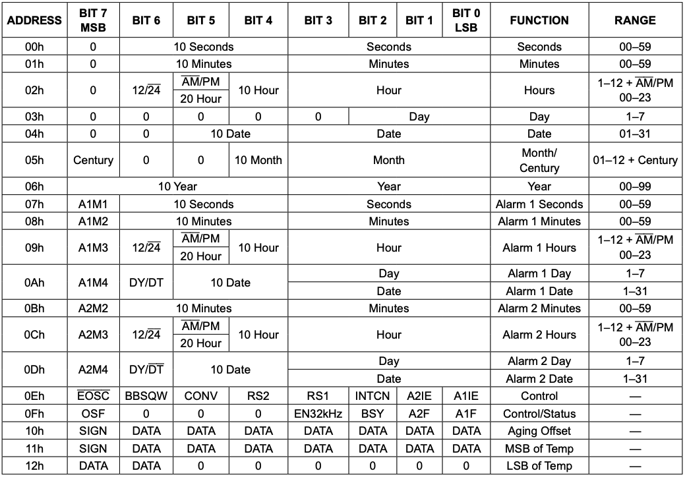
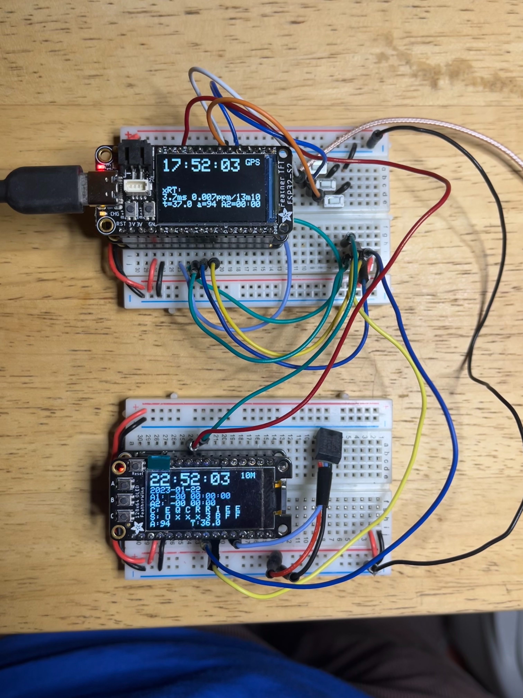

### [ClockBlog](index.html)

## 2023-01-15
# DS3231 RTC Emulator

I’m very attached to the DS3231 temperature-compensated crystal oscillator (TCXO) real-time clock (RTC), particularly the low-cost modules available on Amazon.  I’ve been able to trim them with GPS to better than 0.1 ppm (at least short-term; that’s 3 seconds a year), and I’ve used them in lots of clock builds.

But it’s not the ultimate in clock technology.  I already have GPS-derived clocks which are essentially oracle-accurate.  I also recently got an Oven-Controlled Crystal Oscillator component (OCXO), the [ABRACON-AOCJYR](https://abracon.com/Precisiontiming/AOCJYR-10.000MHz-M5625LF.pdf).

### TCXO vs OCXO
The primary cause of crystal oscillator drift is a variation with temperature: In a TCXO such as ‘3231, the crystal temperature is regularly measured, and the circuit changes to compensate for the changes (e.g., by switching in and out small loading capacitors).

An OCXO takes a different approach: The crystal is held at a constant temperature with a small heating element and a thermostat.  Of course, this is far more power-hungry (since we’re constantly maintaining the crystal at some elevated temperature, and indeed relying on thermal loss to the environment in order to be able to control it) but it almost completely removes the influence of ambient temperature variation.  My OCXO claims a short-term stability of < 2 ppb per day (0.002 ppm).

However, whereas the DS3231 is a lovely integrated device that sits on the I2C bus and will report the current date and time when requested, the OCXO is just a crystal pumping out rock-steady 10 MHz oscillations.  It needs additional wrapping to turn it into a clock service.  (It’s also not a good candidate for battery-backup owing to the steady ~0.4W power consumption, compared to 0.4 mW when the DS3231 is on battery).

### Emulating a DS3231 with an OCXO
Given my existing builds that use a plug-in DS3231 module, I thought it would be nice to build a wrapper around the OCXO that looks from the outside just like a DS3231, for both reading and setting the time, and even for generating the 1 Hz output (which I use for precise synchronization in some systems), and why not the alarms also?  Hence, I embarked on a coding project to emulate the DS3231 using Arduino code.

From the point of view of the I2C interface, the DS3231 is simply an array of 19 bytes:



So the basic functionality is to set up an Arduino to allow reads (and writes) to a small array of bytes over I2C.  The Wire library we use to access I2C devices from the Arduino (i.e., I2C Main mode) also supports acting as a Secondary, and provides two interrupt handler hooks to respond to bytes being sent to the Secondary, and bytes being requested from the Secondary.

(Note: I developed this using the Arduino IDE on two MCUs, the Adafruit RP2040 Pico Feather, and the Adafruit ESP32-S3 TFT Feather.  It turns out the I2C Secondary routines don't quite work for this -- on a ```write_then_read``` transaction, the read (request) interrupt is handled *before* the write (receive) interrupt.  Since the write sets up the address that the read is supposed to reflect, this was not viable.  However, the RP2040 (using Philhower's core) worked great.)

The Emulator code is set up to service these requests by reading and writing the 19 registers.  It has a small amount of additional logic to advance the clock registers (and trigger any alarms) once per second.  You could use different mechanisms to ensure this routine is called precisely each second, but for this project we're going to use the 10 MHz OCXO.

One twist is that to minimize the latency between the 'tick' instant and the update of the outputs (including the SQWV output edge), the code precalculates the register file for the *next* second, then swaps in this register very quickly once the tick event occurs.

I also integrated some separate code I wrote as a DS3231 Explorer, which reads and displays all the registers (as well as providing a simple command-line interface over the Serial port to set them all).  The code for this combined Emulator-Explorer is here:
https://github.com/dpwe/arduinoclocks/blob/main/DS3231_emu_exp/DS3231_emu_exp.ino

### Getting the 1 pulse-per-second timebase
With the emulator ready to go, the last part is configuring the MCU to count the pulses from the OCXO, and advance the clock after every 10 millionth.  At first look, the RP2040 does not appear to have a counter for external inputs; however, the PWM subsystem includes a variety of mechanisms for gating the system clock that drives its 16 bit counters, including a mode that allows just one count for each edge on an external pin.  This provides a very effective counter for input pulses.  I already explored this with my [RP2040 pulse counter library](https://github.com/dpwe/FreqCountRP2).

Because it's only a 16 bit counter, the counter overflow handler has to keep track of the overall total; when fewer that 2^16 (65,536) oscillator counts remain before reaching 10^7, the counter TOP (overflow) is reduced to ensure the next overflow interrupt happens precise when desired, whereupon the emulator's ```tick``` routine is called.

The basic resolution of a 10 MHz oscillator is 100 ns (1/10^7).  However, the code provides 1 ns resolution, on the average, by maintaining a "nanoseconds-per-second" overflow count, advanced at each tick, then, when it exceeds 100, stretching or shrinking by one the number of crystal pulses until the next tick.  This parts-per-billion (ppb) trim is adjustable at run-time via the DS3231's "Aging Offset" register (on a real DS3231, the Aging Offset register adjusts by around 50-100 ppb for each step, instead of the 1ppb/step here).

This all works pretty well, and the run-time adjusting of the Aging Offset afforded by the Synchronizer makes it easy to tune down to 5ppb or better over the short term.  However, the values required to achieve this trim have been different on different days, raising questions about the longer-term stability of the OCXO.  The problem may, however, stem from variations in the supply voltage, since the datasheet promises around 10ppb variation for a 5% change in supply voltage (i.e., 165 mV change on a 3.3V supply).  The power feed resistances of my breadboard (a few Ohms) could easily introduce drops of this scale given the 100 mA steady-state current draw.

So long-term stability measurements must wait for me to build a logging rig for the setup and leaving it running for a couple of weeks (ideally with simultaneous ambient temperature logging, and comparing to a real DS3231 and a GPS reference).  In the meantime, though, it's working nicely.



*Synchronizer running on ESP32 TFT Feather (top) stacked with a GPS receiver and a local DS3231, reading the DS3231 Emulator running on an RP2040 Pico Feather (bottom) counting pulses from the 10 MHz OCXO.*
