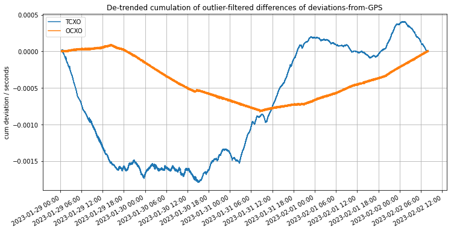
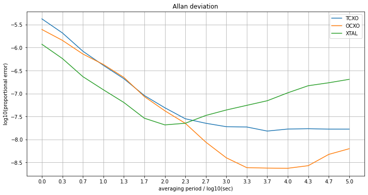

### [dpwe](https://github.com/dpwe) [ClockBlog](https://dpwe.github.io/arduinoclocks/)

## 2023-02-12
# Comparing clock stability with Allan Deviation

In my [previous post](2023-01-15-ds3231-emulator.html), I described how I was adapting an oven-controlled crystal oscillator (OCXO) to behave like an integrated Real-Time Clock (RTC) chip (the DS3231, which is a temperature-compensate crystal oscillator, TCXO) -- i.e., keeping track of the date and time, and providing an interface for setting the time.  Because I used the Adafruit RP2040 Feather, it also supports battery-backup, although because the OCXO is quite power-hungry, the battery is only to tide it over brief power disconnections.

Once the clock was working, I naturally wanted to be able to measure its accuracy.  I'd previously developed the [synchronizer](2022-03-20-synchronizer.html) program to calculate the accuracy of DS3231 RTCs against a GPS reference.  But I hadn't looked in detail at how this accuracy varied on the scale of days, and this is the area where the OCXO should shine.

### Clock log data

I modified the Synchronizer to log the difference between the one-second instants (so called pulse-per-second or PPS signal) for the TCXO and OCXO clock, relative to the output of a GPS receiver, which allegedly generates a PPS in sync with the super-stable reference used to co-ordinate the satellites.  Generally, the GPS PPS is quoted as being accurate to 10 ns (0.01 µs).  Logging was achieved by recording the messages printed to the Arduino "Serial-over-USB" output to a file on my Raspberry Pi host.

I collected 377,000 samples (somewhat over 4 days) before the system crashed (I2C lockup?).  About one in a thousand of the measurements were messed up (noise on the PPS lines?), but there was plenty of data to work with.  After a small amount of cleanup, I could plot the running error between the local clocks and the GPS reference:

We see that both clocks stay with a couple of milliseconds of the GPS reference over the 4 day measurement period (although this plot actually removes the average offset and slope to aid readability - that's why both curves both start and end at zero).  But the important thing to notice is that the OCXO seems to maintain a mostly-constant slope (fixed frequency deviation or drift) over multiple hours, whereas the TCXO is wandering around all the time.

### Measuring Clock Stability

It turns out that characterizing the accuracy of a clock isn't entirely straighforward.  A given clock will have some error (offset) compared to a stable reference, but that error will also likely change systematically with time (drift).  However, to a large extent, drift is not a terribly serious problem, as long as that drift is known and constant, since it would then be trivial to calculate the true time.

So what really matters in a clock is how stable its timekeeping is over different time scales.  The standard way of characterizing this is [Allan Variance](https://en.wikipedia.org/wiki/Allan_variance), developed in the 1960s when very-accurate atomic clocks were first being produced.  The idea is to measure the proportional error between success measurements of supposedly-equal intervals, and to plot this over a wide range of intervals.

At the shortest intervals Allan Variance (or its square-root, Allan Deviation) is typically dominated by the random noise in each time measurement.  Measuring over longer intervals (e.g. summing up 10 or 100 successive intervals) will typically smooth out independent noise in each measurement, leading to more consistent values (when measured by difference as a proportion of total interval).  However, as the intervals become very long, uncontrolled drift in the frequency of the clock will begin to dominate -- if your clock changes its properties by 1ppm per day, that will limit how similar two successive day-long intervals will be.

Thus, Allan Deviation plots, which are plotted on log-log axes, are typically U-shaped: At the smallest intervals, the proportional error drops as the independent errors in each measurement are smoothed out through averaging.  But at some longer measurement interval, the underlying instability and drift of the clock frequency will begin to dominate, and this typically gets worse for longer intervals.

### My Allan Deviations

Using a [Colab](https://colab.research.google.com/drive/1sQLEhoHQcFkfOhnLrahKhTjQoga9geAH) (an online version of IPython/Juyter notebook), I was able to calculate the Allan deviations for my clock logger data (I think I implemented it right, based on what I read online).  The plot compares three clocks, the OCXO and TCXO, and also the uncompensated MCU crystal oscillator (XTAL) which was being used to measure the time differences between the different PPS signals, and whose frequency could be inferred by looking at the measured time between successive GPS PPS edges.

We see the expected U-shaped curves, although ideally we should run for 10 or 100 times longer (like, a year) to get a few more values on the right-hand edge of the plot.

The plot shows error (in log-base-10 units, so -6 is 1ppm) as a function of the averaging period (in log10 seconds, so 3.0 is averaging over 1000 seconds = 18 minutes).  We see the expected negative-slope[^1] decline at the start of the curve corresponding to the smoothing out of random errors in the measurement of each edge.  Those errors are larger for the OCXO and TCXO than for the XTAL, because the XTAL is essentially the measurement noise from the basic timing mechanism (how accurately the system can record the microsecond-timing of the PPS edges coming off the GPS chip), but the other two clocks combine their own measurement noise with the error measuring the GPS.  Still, the gap is quite large.  We expect the log10(error) to be no better than -6 for the 1 sec measurements (log10(period) = 0) because that’s the resolution at which we’re making the measurements (10^-6 = 1 µs).  

Of paramount interest is the point at which the error stops reducing as the averaging period is increased, but instead starts to go up.  This is when the longer-term drift deviations become larger that the independent, per-measurement errors.  As we see, this occurs for periods longer than log10(period) = 2 (i.e., 100 seconds) for the uncompensated XTAL, whereafter it rises quite alarmingly.  For the TXCO, however, the curve reaches a pretty flat floor for periods larger than 1000 seconds (log10(period) = 3), with an error of approaching 10^-8 = 10 ppb.

The OCXO, however, continues benefitting from longer averaging intervals out to around 5000 seconds (90 mins), thereby reaching a deviation of close to 10^(-8.7) = 2 ppb, which is fantastic -- less than 0.1 sec error in a year.  However, it looks like it might be going up again after that, reflecting longer-term drift.  We’ll have to log data for more than a few days to estimate its longer-term stability.

---

[^1]: When averaging noisy values, we usually expect proportional error to decline with the *square root* of sample size, because it's the variances of uncorrelated errors that sum up.  This would appear as a slope of -0.5 in the Allan deviation plot.  However, in this case the errors are *correlated* -- if one sample is particularly late, we expect the next one to be early, because the underlying clock event sequence has not been delayed.  Thus, the absolute error is approximately constant (at around 1 µs) as the interval increases, making the relative error inversely proportional to the measurement duration, leading to a slope of -1.0 in the plot.  This holds only for the range of shorter intervals before long-term drift becomes significant.

