### [dpwe](https://github.com/dpwe) [ClockBlog](https://dpwe.github.io/arduinoclocks/)

## 2023-10-16
# Oven Clock Reader Project

### Problem: My Oven Display Is Unreadable

The gas range in my apartment was here when I moved in 7 years ago.  It's surprisingly hard to identify the model number or find out any specific information online, but it appears to have been manufactured around the year 2000.  It works fine except for one thing: The display was dim.  Reading the clock didn't matter so much, but it was frustrating when trying to set the oven temperature (which is changed by 5 degrees with the UP and DOWN button), and also for monitoring the oven temp while it's heating up.  Here's what it looked like:

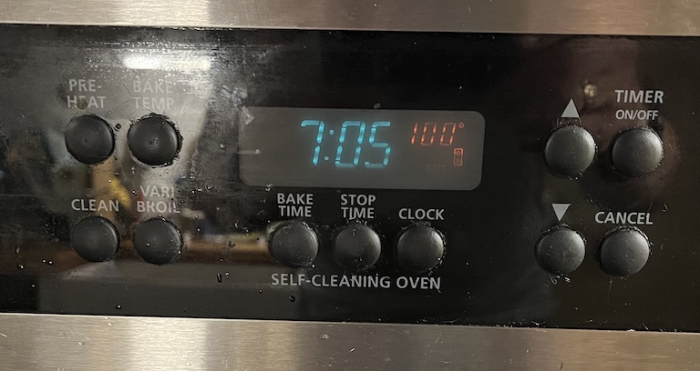

*The VFD oven display that was hard to read.  Blue-green digits are the time, red digits are the oven temperature.*

The display/control electronics board is part number 316080102, long since discontinued.  This picture makes it look pretty legible, but the red numbers were very hard to read, particularly in daylight.

([This thread](https://www.badcaps.net/forum/showthread.php?t=71797) from Bad Caps Forum has a bunch of nice photos of the exact same control board.)

### Diagnosis

This is a somewhat familiar problem with this kind of Vacuum Fluorescent Display (VFD).  VFDs are small vacuum tubes that operate by attracting electrons emitted by filaments (essentially, hot wires running the width of the display) towards anodes coated with a material that glows when the electrons hit it.  But over time this becomes less efficient - the filaments emit fewer electrons, and/or the fluorescent material becomes poisoned and emits less light.  See a slightly more technical description [here](https://www.eevblog.com/forum/chat/vacuum-fluorescent-display-rejuvenation/msg1373799/#msg1373799) from eevblog.

### What to do

The first thing I thought of was to simply replace the VFD display, but there are no replacement parts available from the usual appliance repair sites.  Even the entire control modules are apparently very scarce - there are services on eBay that offer to refurbish malfunctioning ones, but most exclude problems with dim display.  A few places will fix the display for about \$200.  [This video](https://www.youtube.com/watch?v=bSUa4f8KvhM) from Nick's Electronic Repair in Tucson AZ shows him performing such a repair on the exact same control board.  

He doesn't say where he got the replacement VFD, but you can read the part number in the video: Futaba 7-LT-91G.  Original equipment doesn't seem to be available, but there are a lot of factories in China advertising compatible parts on alibaba.  This page has a nice set of details on their version, including a full pinout.

\$200 seemed expensive and I didn't like the idea of being without the control board for my oven for a week or more while it was out being repaired.  The [EEV Blog post](https://www.eevblog.com/forum/chat/vacuum-fluorescent-display-rejuvenation/msg1373799/#msg1373799) mentioned above describes a process of "flashing" the filaments to boost their remaining electron emissivity: run them for a short period at a higher voltage/current than usual until they glow, with some effect on the underlying metallurgy.

I bought a constant-current desk supply and carefully disconnected the filament supply from the rest of the circuit and ran a higher current through until the filaments glowed.  I ran them at 260 mA for a minute, very hopeful that would improve things; I put the oven back together, but couldn't see any change.  So then I tried 350 mA, which made the filaments glow a healthy yellow. I put it all back together, and the display was *much worse* - the clock digits were no longer legible, and the red temperature digits didn't show up at all.  I guess I over-cooked it, or the display was so old that it was beyond rejuvenation.

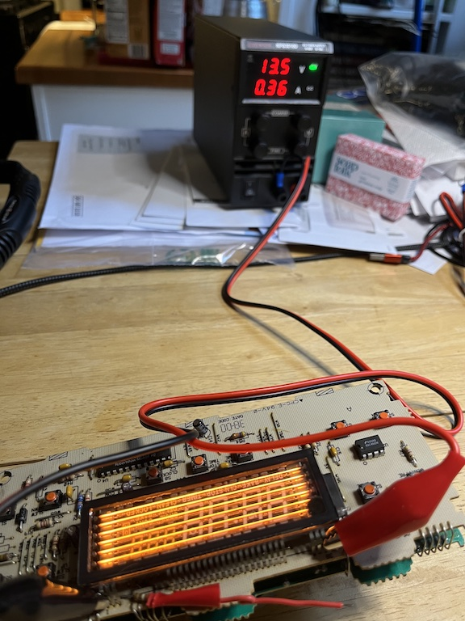

*"Flashing" the cathode filaments by running 360 mA through them for 60 sec.*

### Plan B: A Substitute Display

VFD displays of this kind are usually multiplexed, which means rather than having a separate wire for every distinct segment on the display, they have a set of wires connected to all of the display elements (e.g., the 7 segments of the numbers) in parallel, then a separate set of wires that select which of the digits is being addressed.  Then, the electronics cycles through the digits, lighting up each one in turn with the appropriate digit.  Doing this fast enough gives the appearance of a single, static display.  There's a nice discussion of the electrical behavior of VFDs [here](https://www.noritake-elec.com/technology/general-technical-information/vfd-operation), from Noritake, a VFD manufacturer.

This is the same principle used in most 7-segment LED displays, which led someone to wonder if it's possible to [replace the VFD displays with LED displays](https://www.diyaudio.com/community/threads/replacing-a-vfd-display-with-led-s-possible.136422/). In principle that's a feasible approach, but in practice that means translating the -6 V / +24 V voltages used for both the per-digit "grid" anodes and the per-segment anodes into +3 V-ish for the per-digit LED anodes, and open-collector current sinks for the per-segment cathodes.

But it did make me think: The grid and segment voltages are essentially just logic levels.  If I could connect them to an MCU, I could interpret the display, then re-render the information on a new display in whatever format I wanted.  I have the full pin-out from above, so it shouldn't be too hard to interpret the signals correctly.

### Examining the control voltages

For sure I would need to level-shift the voltages from the 30 V swing expected for the display (according to the Noritake tutorial) to the 3.3 V logic input of a modern MCU chip.  I also needed to figure out the timing and sequence of my particular display. So I gingerly powered-up the oven control board outside of the oven and on my workbench so I could hook it up to my oscilloscope.  (I hadn't had to power it up to flash the filaments; the board has raw 110v running into it which I didn't fancy near my fingers, but it turned out OK.)

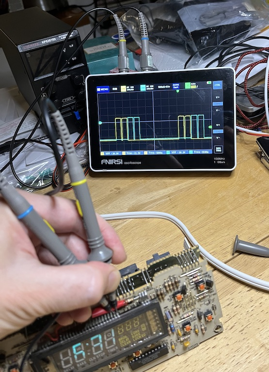

*Inspecting the grid anode timings with my oscilloscope.*

The picture shows the first two "grid" (digit select) pins.  We see they are periodically activated with a pair of roughly 400 us pulses every 4 ms or so, with 50 us gaps between each pulse.  Overall, the 4 ms cycle is divided into 10 subcycles; the first three digits get two adjacent subcycles each, then the remaining 4 digits get one each of the remaining 4 subcycles (I'd expect that to make the first 3 digits -- the first 3 clock digits -- twice as bright as the remainder, but I never noticed that).  The 11 segment anodes are activated in sync with the corresponding grid anodes in order to generate the intended display.

That's the timing.  The voltages, referenced to what appears to be the system ground based on the trace layout, is +6 V for active and -24 V for inactive.  These are a bit different from the voltages in the Noritake tutorial, but it all lines up because, relative to the ground I used, the 3VAC filament supply is biased at -19 V.  So there's a 25 V forward potential to accelerate the electrons towards the segments, and a -5 V negative potential to keep electrons off the inactive segments.

Sampling the timing will be handed in software, but to make those voltages friendly to an MCU, I need to clip/drop them to between 0 and 3.3 V.  I did this with a combination of a diode (to block the negative voltage) and two resistors acting as a voltage divider to drop it down to 3.3 V (anything from 2 V to 3.3 V would probably have been OK, but the resistors I had on hand made 3.3 V easiest).  I have to do this independently for the 7 grid and 11 segment anodes, i.e. 18 instances.  The circuit is basically this:

```
 VFD Anode Drive  o----|>|----^v^v^v-----+-------o  RP2040 input pin
  -24 .. +6V         1N4148   12 Kohm    |            0 .. +3.3V
                      diode              >
                                 22 Kohm <
                                         >
                                         |
                                        ///
```
I built one instance to test it out.  Oscilloscope says it looks good:

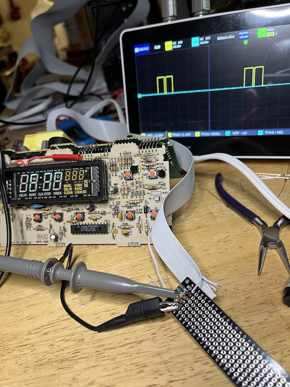

*Testing the first instance of the voltage shifter circuit*

In the picture you can also see the 20-strand ribbon cable I chose to carry the voltages out of the oven to my add-on display.  I had a nice long chunk of cable I pulled from a 1990s-era workstation that was being junked, so I was able to extract a roughly 2 foot length for this project.

With that confirmed, I slogged through making all 18 level shifter circuits, and wiring the other end of the ribbon cable to the anodes on the oven control board.  I also tapped off the 0 V and 12 V power supply lines, making 20 wires total.

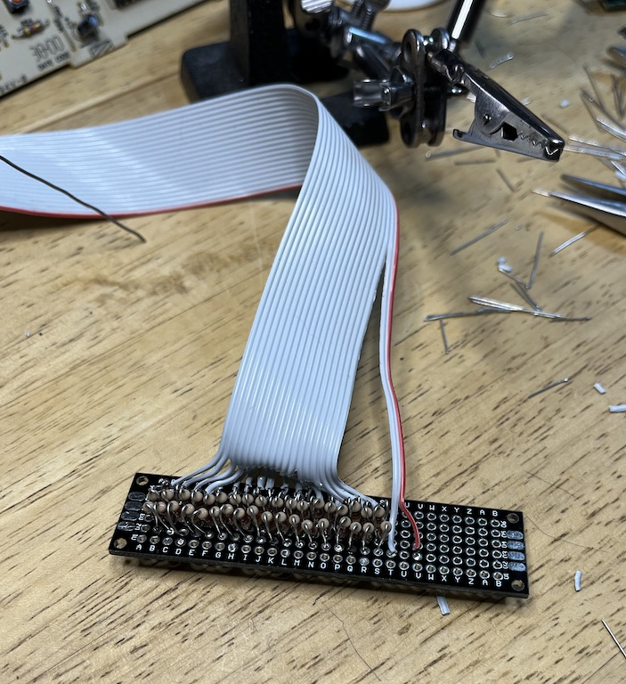

*The completed assembly of 18 voltage shifter circuits.*

Connecting to the oven control board was also a lot of soldering.  I went in on the underside of the display circuit board and picked up the pins feeding the display, using the pinout from alibaba as guidance.

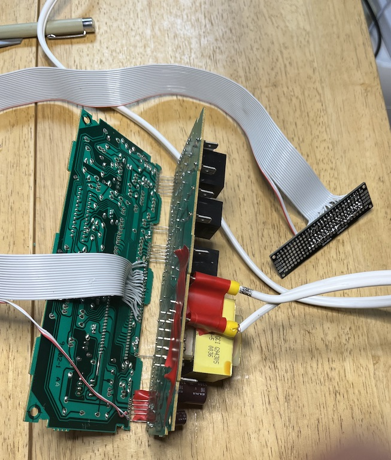

*Connecting the other end of the ribbon cable to the VFD anodes on the back of the oven control unit.*

I carefully metered everything through before powering it up, since I didn't want to mess with the relatively larger voltages driving the VFD.  To my horror, two of the pins were shorted.  I reinspected everything but couldn't see the flaw.  Then I looked at the control board circuit traces - it turns out that segments 10 and 11 are connected together on the driver board; segment 11 is only used for digit 6, where it adds the "ED" to the end of "LOCK" (to make LOCKED).  I guess my oven never needed to say LOCK instead of LOCKED (and so I actually only needed 17, not 18, inputs).

### Coding time

Next, it was time to setup the MCU.  I chose the [Raspberry Pi RP2040 Pico](https://www.raspberrypi.com/documentation/microcontrollers/raspberry-pi-pico.html) microcontroller, primarily because it has a lot of GPIO pins (26 in all) as well as being very cheap (under $10) and plenty powerful (two 125 MHz ARM cores, 264 kB of RAM, 2MB flash). I prototyped on a breadboard, soldering a set of rainbow breadboard jumpers to my level shifter.  I then wrote [code](https://github.com/dpwe/oven_clock_reader) in the Arduino IDE which triggered an interrupt on each of the 7 grid anodes positive-going edges, then waits 100 us to make sure the segment voltages are stable, then reads in the 11 segment levels.  The 100 us delay needed a bit of research - I wanted that to be an interrupt too, and ended up using the hardware_alarm_* API for which I couldn't find many examples online, but which worked great.

Once I had read in the segments for each digit and interpreted them into the intended digit (using a lookup table of "known 7-segment patterns", which I made up, and includes things like "F" and "-" used in error codes, etc.), I could re-render the display content onto any display I chose.  I went with a 4" diagonal 128 x 64 LCD matrix because I like the look of them, and because they are bright, highly readable, and suitable for 24 hour operation with a long lifespan (a more modern OLED display would have had a shorter lifespan than even the original VFD).  Using the u8g2 library and a SPI-driven ST7920-based display, it was very easy to get this running.  Finally I was ready to try it all out!

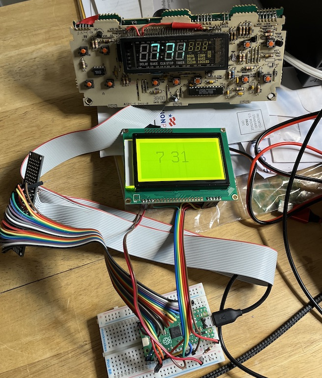

*First live test of the oven clock reader driving an LCD display.*

To my delight it worked (well actually the first time I knew it worked, I just printed out the interpreted time to the Arduino serial terminal, but that doesn't make such a good photo).  So then I went on to implement all the segments including the extra words.  This is the display where I "faked" the input as if all the segments were on for all the digits:

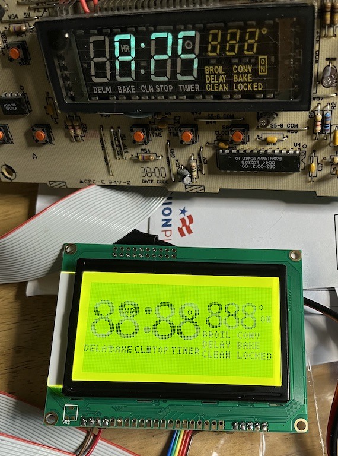

*Final form of the LCD display duplication with "all segments on".*

You can see how my rendering routine closely matches the content and layout of the original VFD.  Some of the characters overlap, but I don't think they ever need to be displayed at the same time.  In fact, I'm not sure if all of the segments are used at all, but my reader will display them if they are!

### Moment of truth

Here's the complete prototype assembly ready to be reinstalled in the oven.  I put the LCD display along with the breadboard in a little plastic box to keep them a little bit protected and held-together.

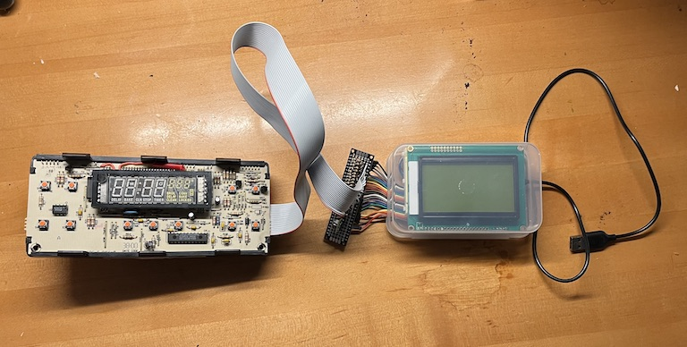

*Complete assembly ready to be installed back in the oven.*

To my delight, back in the oven, everything worked great (it didn't fully work outside the oven, I guess because it has some sensors that were not giving the right values when disconnected).

After a few days, however, the messiness of the breadboard setup with the level shifter board just floating around next to it bothered me too much, so I soldered up the connections to the MCU and display to eliminate the rainbow cable and the breadboard.  This became very neat and all fit inside the plastic case.  Here's a view of that wiring, using high-flexibility hookup wire except for the red and black power connections which are solid-core (and provide some stability to the assemblage):

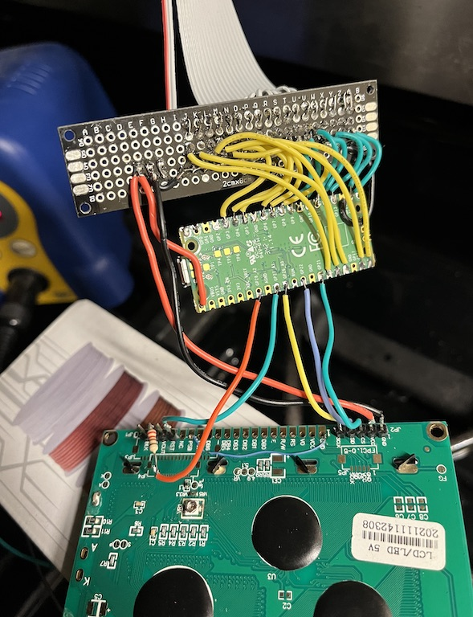

*RP2040 Pico rewired to eliminate the breadboard and rainbow cable.*

Here's a back view of the boards in their final alignment and closed inside the case.  Here, you can also see a top-view of the switch-mode 7805 replacement I used to get the 5 V bus supply for the RP2040 from the 12 V supply line tapped from the oven control board.

[Back of the display module](images/oven11-rewired-back.jpg)

*Back view of the assembly inside its case.*

Finally, here is the display module in its proper place, accurately and legibly mirroring the now sadly-diminished original VFD display:

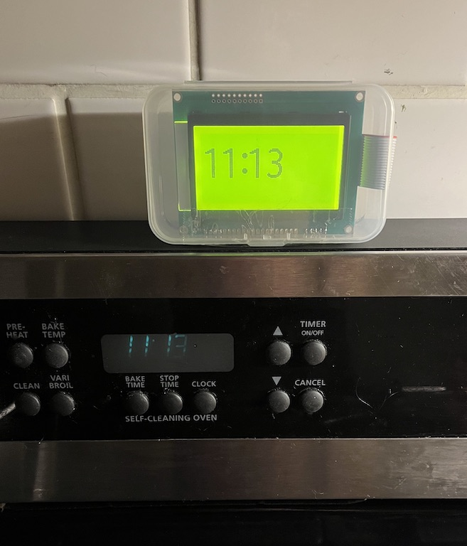

*Final installation of the replacement display.  The ribbon cable runs neatly down the back and into the oven.*

It's a really satisfying fix, even though it's a bit misleading because I can't actually control my oven via the MCU, only listen to what it was trying to say.  Still, it's now a unique "hybrid" oven!
